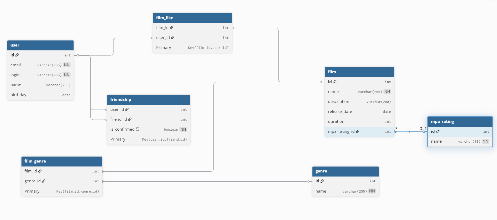

## Схема БД (ER-диаграмма)



## Описание таблиц

Основу данных составляют таблицы `user` и `film`, которые хранят информацию о пользователях и фильмах соответственно.

Для хранения стандартизированных значений, таких как жанры и возрастные рейтинги MPA, были созданы отдельные таблицы-справочники: `genre` и `mpa_rating`. Такой подход позволяет избежать дублирования данных и упрощает их обновление.

Связи "многие-ко-многим" реализуются через промежуточные таблицы. Таблица `film_genre` связывает фильмы с их жанрами. `film_like` отслеживает, какие пользователи поставили лайки фильмам, что необходимо для расчета популярности. Таблица `friendship` реализует механику дружбы между пользователями, включая статус подтверждения (`is_confirmed`).

## Примеры SQL-запросов

### Получение всех фильмов с их жанрами и рейтингом MPA

```sql
SELECT
    f.id,
    f.name,
    f.description,
    f.release_date,
    f.duration,
    mr.name AS mpa_rating,
    GROUP_CONCAT(g.name SEPARATOR ', ') AS genres
FROM
    film AS f
JOIN
    mpa_rating AS mr ON f.mpa_rating_id = mr.id
LEFT JOIN
    film_genre AS fg ON f.id = fg.film_id
LEFT JOIN
    genre AS g ON fg.genre_id = g.id
GROUP BY
    f.id;
```

### Запрос на получение 10 самых популярных фильмов

```sql
SELECT
    f.id,
    f.name,
    COUNT(fl.user_id) AS likes_count
FROM
    film AS f
LEFT JOIN
    film_like AS fl ON f.id = fl.film_id
GROUP BY
    f.id
ORDER BY
    likes_count DESC
LIMIT 10;
```

### Поиск общих друзей для двух пользователей (id 1 и 2)

```sql
SELECT
    u.*
FROM
    friendship AS f1
JOIN
    friendship AS f2 ON f1.friend_id = f2.friend_id
JOIN
    user AS u ON f1.friend_id = u.id
WHERE
    f1.user_id = 1 AND f2.user_id = 2
    AND f1.is_confirmed = true AND f2.is_confirmed = true;
```

